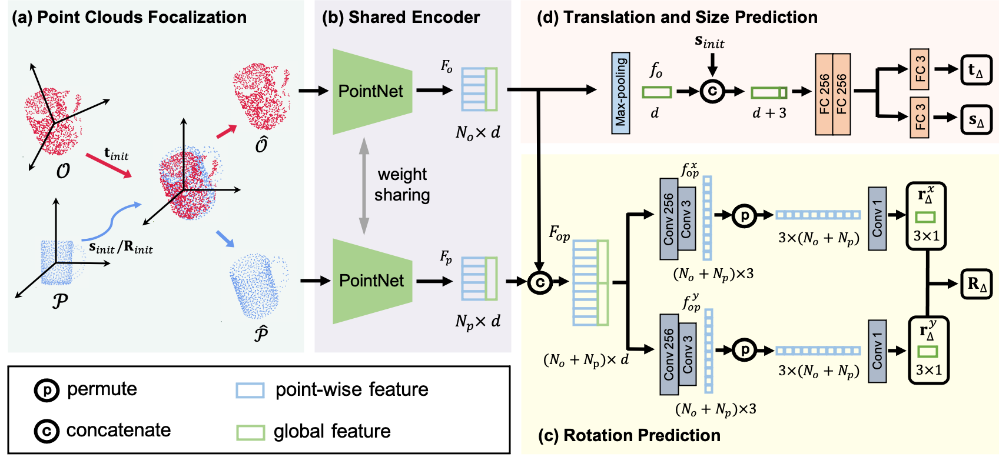

# CATRE

This repo provides for the implementation of the ECCV'22 paper:

**CATRE: Iterative Point Clouds Alignment for Category-level Object Pose Refinement**

## Overview

<p align="center">

<p>

## Dependencies

See [INSTALL.md](./docs/INSTALL.md)

## Datasets

Prepare datasets folder like this:
```bash
datasets/
├── NOCS
    ├──REAL
        ├── real_test  # download from http://download.cs.stanford.edu/orion/nocs/real_test.zip
        ├── real_train # download from  http://download.cs.stanford.edu/orion/nocs/real_train.zip
        └── image_set  # generate from pose_data.py 
    ├──gts             # download from http://download.cs.stanford.edu/orion/nocs/gts.zip
        └── real_test
    ├──test_init_poses # we provide 
    └──object_models   # we provide some necesarry files, complete files can be download from http://download.cs.stanford.edu/orion/nocs/obj_models.zip
```

Run python scripts to prepare the datasets. (Modified from https://github.com/mentian/object-deformnet)
```bash
# NOTE: this code will directly modify the data
cd $ROOT/preprocess
python shape_data.py
python pose_data.py
```

## Reproduce the results

The trained model has been saved at `output/catre/NOCS_REAL/aug05_kpsMS_r9d_catreDisR_shared_tspcl_convPerRot_scaleexp_120e/model_final_wo_optim-82cf930e.pth`. Run the following command to reproduce the results:

```
./core/catre/test_catre.sh configs/catre/NOCS_REAL/aug05_kpsMS_r9d_catreDisR_shared_tspcl_convPerRot_scaleexp_120e.py 1  output/catre/NOCS_REAL/aug05_kpsMS_r9d_catreDisR_shared_tspcl_convPerRot_scaleexp_120e/model_final_wo_optim-82cf930e.pth
```

## NOTE

**NOTE** that there is a small bug in the raw evaluation [code](https://github.com/hughw19/NOCS_CVPR2019/blob/78a31c2026a954add1a2711286ff45ce1603b8ab/utils.py#L252) of NOCS w.r.t. IOU. We fixed this bug in our evaluation code and re-evaluated all the compared methods in the paper (we only revised the value of IOU and kept rotation/translation results the same, but indeed the accuracy of R/t will also change a little bit).  See the revised [code](https://github.com/THU-DA-6D-Pose-Group/CATRE/blob/b649cbad6ed2121b22a37f7fe16ad923688d4995/core/catre/engine/test_utils.py#L158) for details.

## Training

`./core/catre/train_catre.sh configs/catre/NOCS_REAL/aug05_kpsMS_r9d_catreDisR_shared_tspcl_convPerRot_scaleexp_120e.py <gpu_ids> (other args)`

## Testing
`./core/catre/test_catre.sh configs/catre/NOCS_REAL/aug05_kpsMS_r9d_catreDisR_shared_tspcl_convPerRot_scaleexp_120e.py <gpu_ids> <ckpt_path> (other args)`

## Citation
If you find this repo useful in your research, please consider citing:
```
@InProceedings{liu_2022_catre,
  title     = {{CATRE:} Iterative Point Clouds Alignment for Category-level Object Pose Refinement},
  author    = {Liu, Xingyu and Wang, Gu and Li, Yi and Ji, Xiangyang},
  booktitle = {The European Conference on Computer Vision (ECCV)},
  month     = {August},
  year      = {2022}
}
```
